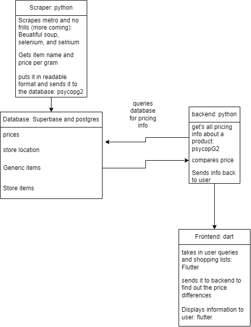

# Penny/Boolean Boos

## Software Summary
<!-- 1. Summary of your software (you can reuse the same submission in D1 if it hasn’t changed). -->

<!-- a. One paragraph for the problem & partner (if applicable) -->
Penny is an app which empowers shoppers to maximize their grocery savings by comparing unit prices across various stores and locations. For users, the advantage is clear: they can easily see the products they're interested in and assess which store offers the best deal. With transparency in pricing, this app enables customers to make informed choices and save money on their grocery bills. Additionally, Penny allows users to organize their shopping lists by store, letting them select the most cost-effective options for each item.  This venture is in collaboration with Kevin Lee (Founder and Product Designer), and is being developed based on his pre-existing software.

<!-- b. One paragraph introducing any existing software/infrastructure (if applicable) -->
Penny's infrastructure is built on a robust and diverse technological stack. It primarily utilizes Flutter and Dart, for efficient cross-platform development for both iOS and Android devices. The backend is enhanced by Supabase, ensuring scalability and real-time data handling. C++ and CMake are used and are integral for optimizing performance and managing the build process. Ruby is also used to facilitate streamlined scripting and Swift is used to ensure the iOS version is optimized. HTML is also employed for web implementation. The combination of these technologies ensures adaptability, performance, and scalability to meet evolving Penny's users' needs and technical demands.

## Dividing the Project
<!-- 1-4 paragraph(s) on how you decided to divide the project and why. Ideally, this will be accompanied by a software architecture diagram and how each component connects to the others. -->

We divided our project into three distinct sub-teams: frontend, backend, and data. This division was aimed at promoting an efficient development process by allowing each team to leverage their respective strengths. We allocated 2, 3, and 2 team members to the frontend, backend, and data teams, respectively, after several considerations. We recognized that the backend would require a substantial team to manage core functionalities and handle server-side processing, making it the largest team. For the frontend and user-interaction aspects, we assigned team members with experience in Dart and Flutter, the framework we are using. Also, the database team was crucial for data collection and processing. Each sub-team plays a vital role in achieving our project goals, and this structure ensures a balanced workload. Each team has at least one member to review their work and progress. Furthermore, we are maintaining communication across teams to make sure that the project connects together seamlessly at the end.

The **frontend sub-team** is primarily in charge of designing and implementing the user interface of the app. The responsbilities of this team plays an integral part of the project, as a client would be using and interacting with their work directly. Thoughout the semester, this group will collaborate closely with the partner to ensure the visual and interactive elements of the app align with the intended design specifications. Further into the project, this team will also be tasked with optimizing the app's performance across various devices and platforms, integrating with backend services, and ensuring the overall usability and user experience are seamless and intuitive.

The **backend sub-team** is responsible for all the backend features and functionalities that will help support Penny and allow the app to function as laid out in our user stories. We decided to include this team as a part of our divided project, as the backend functionalities are imperative for Penny to work and function as intended. 

<!-- TODO: database -->
The **database sub-team** ...

### Software Architectural Diagram

## Sub-Team Responsibilities
<!-- One paragraph for part(s) each sub-team is responsible for -->

### Frontend

### Backend
As stated earlier in the "Dividing the Project" section of our deliverable document, the backend team is mainly focused on the functionalities that happen behind the scenes. There are a variety of different actions a user can take in which the backend supports, such as selecting, searching, and sorting through grocery store items, searching and displaying stores with their items and respective prices, creating and managing a user account, and more. These functionalities stated are implemented in our deliverable 2, with further features such as location-based data and utilizing a user's current location being implemented later on. Our backend team is utilizing Python in order to bring these features to life, as well as using a JSON file containing hard-coded data that is used in our backend functions. This hard-coded data is only intended for the use of backend functionalities in this deliverable, and will be removed once the database is fully connected to the backend.

### Database
The database team is responsible for populating the database with information about the products and keep an up-to-date snapshot of the current prices of the products in the stores. This will allow the backend team to accurately  compare prices across different stores. Note the database already existed by the time we entered the project but this team is also responsible for any changes we will need to make to the database. We will use python as a library for most of the scraping portion. We will use Beautiful soup and Selenium to scrape the data and then use psycopg2 to upload the data to the database. The team will also eventually be responsible for showing the backend team how to use and connect to the database. The biggest responsibility of the team for now is figuring out how to scrape the data from Metro and No Frills and uploading it to the database. This will eventually extend to other websites but for now we are focusing on these two. This task ended up being harder than expected due to the use of java-script and bot protection on both websites.